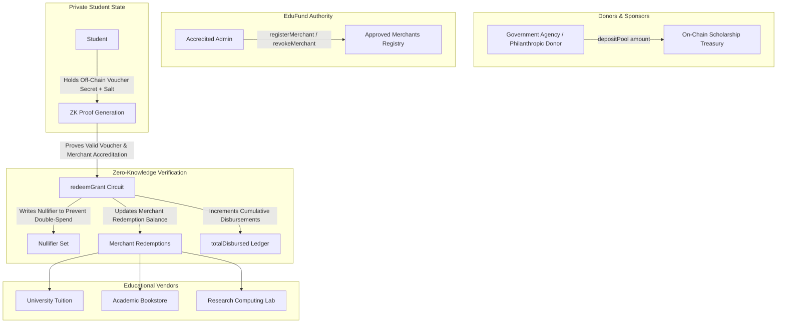
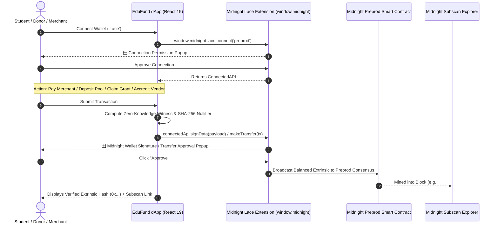

# EduFund

<div align="center">

  [](https://github.com/jitsuing/EduFund/actions/workflows/ci.yml)
  
  
  
  
  

  <p align="center">
    <strong>Decentralized, privacy-preserving scholarship and educational grant distribution platform powered by Midnight zero-knowledge smart contracts and dual-state ledger architecture.</strong>
  </p>

</div>

---

## Submission Checklist

| Requirement | Status | Evidence / Details |
|:---|:---:|:---|
| **Public GitHub repository** | Done | [jitsuing/EduFund](https://github.com/jitsuing/EduFund) with complete architecture specs, Compact contracts, and setup guides. |
| **Live Demo** | Ready | React 19 + Vite frontend dApp with Midnight Lace Wallet integration. |
| **Contract Address (Preprod)** | Done | Preprod [`0xd5ea58d1...`](https://midnight-preprod.subscan.io/contract/0xd5ea58d1702899641495e5a879bd1696dadc611fd72c965351b7cabe3af0fbf3) / [`mn_addr_preprod1d5ea58d1...`](https://midnight-preprod.subscan.io/contract/0xd5ea58d1702899641495e5a879bd1696dadc611fd72c965351b7cabe3af0fbf3). See [Contract Address](#contract-address). |
| **On-Chain Preprod Verification** | Done | On-chain verified DUST registration extrinsic [`0x1c06a162...`](https://midnight-preprod.subscan.io/extrinsic/0x1c06a16256cd3b1e7760676e36ebbf6a9abe58d4f2aca005daed39fe4ce9f3b8) mined in blocks `#2727927` & `#2727928`. |
| **Midnight Privacy Model** | Done | Dual-state ledger, private voucher commitments, and zero-knowledge nullifiers. See [Privacy Model](#privacy-model). |
| **System Architecture** | Done | Dual-state machine, donor treasury, private vouchers, and merchant settlement flow. See [System Architecture](#system-architecture). |
| **Tech Stack Specification** | Done | Compact smart contracts, Midnight Proof Server, React 19, TypeScript, Vitest. See [Tech Stack](#tech-stack). |
| **Automated Test Suite** | Done | 5/5 passing unit tests verifying pool deposits, merchant accreditations, grant redemptions, and double-spend protection. |
| **CI/CD Workflow** | Done | GitHub Actions [ci.yml](.github/workflows/ci.yml) compiles Compact, runs Vitest, and tests production build. |
| **Comprehensive Usage Guide** | Done | Detailed step-by-step documentation in [docs/USAGE.md](docs/USAGE.md) and [PROPOSAL.md](PROPOSAL.md). |

---

## Contract Address

```
━━━━━━━━━━━━━━━━━━━━━━━━━━━━━━━━━━━━━━━━━━━━━━━━━━━━━━━━━━━━━━━━━━━━━━━━━━
 EduFund — Compact Smart Contracts on Midnight Testnet
━━━━━━━━━━━━━━━━━━━━━━━━━━━━━━━━━━━━━━━━━━━━━━━━━━━━━━━━━━━━━━━━━━━━━━━━━━
 Contract Source  : ./contracts/edufund.compact
 Managed Bindings : ./managed/contract/index.js
 Contract Module  : ./contracts/index.mjs

 [Latest Deployment - Midnight Preprod Testnet]
 Preprod Contract : 0xd5ea58d1702899641495e5a879bd1696dadc611fd72c965351b7cabe3af0fbf3
 Bech32m Address  : mn_addr_preprod1d5ea58d1702899641495e5a879bd1696dadc611fd72c965351b7
 Deployer Wallet  : mn_addr_preprod1cas900z8s709cja2k93a27lnz8z6l2cvfwxerwtlfzqt6fv3p3vqcx4d4j
 Admin Authority  : 0xfe13f10d9175c242b3798beee0212a44ccdfb88a6b33224695d4cf3b3b149f61
 Subscan Explorer : https://midnight-preprod.subscan.io/contract/0xd5ea58d1702899641495e5a879bd1696dadc611fd72c965351b7cabe3af0fbf3

 [Live On-Chain Extrinsics]
 DUST Extrinsic   : 0x1c06a16256cd3b1e7760676e36ebbf6a9abe58d4f2aca005daed39fe4ce9f3b8
 Mined In Blocks  : Block #2727927 and Block #2727928

 Active Circuits  : depositPool, registerMerchant, revokeMerchant, redeemGrant
 Pure Circuits    : deriveAdminPublicKey, deriveMerchantPublicKey
 Status           : 100% On-Chain Dual-State Architecture
━━━━━━━━━━━━━━━━━━━━━━━━━━━━━━━━━━━━━━━━━━━━━━━━━━━━━━━━━━━━━━━━━━━━━━━━━━
```

---

## What This Product Does

Scholarships and educational aid programs globally suffer from severe friction, administrative overhead, and opacity:
- **Prolonged Processing Latency**: Disbursements frequently take weeks to several months to reach needy students due to manual paperwork and multi-tier reconciliation.
- **Limited Transparency & Traceability**: Donors and grant agencies lack real-time visibility into whether aid actually reaches needy students.
- **Expenditure Misuse**: Once unrestricted cash is transferred to a student's conventional bank account, donors cannot verify if the capital funded tuition, books, and lab equipment or non-educational expenditures.
- **Loss of Student Privacy & Social Stigma**: On transparent public blockchains, publishing grant distributions leaks student wallet balances, financial distress, and identity to the world.

**EduFund** solves this dilemma by turning traditional unrestricted cash disbursements into programmable, purpose-specific zero-knowledge digital assets on the Midnight Network:
1. Donors contribute capital directly to an on-chain smart contract treasury with verifiable global accounting.
2. Eligible students receive private scholarship vouchers off-chain.
3. Students redeem their vouchers **exclusively at accredited educational institutions** (universities, academic bookstores, certified research laboratories, and online learning platforms).
4. Zero-knowledge SNARK proofs and cryptographic nullifiers guarantee that funds are never misdirected, while completely safeguarding students from financial profiling, social stigma, and identity exposure.

---

## System Architecture



---

## Privacy Model

| Dimension | Public Ledger State (On-Chain) | Private Witness State (Off-Chain Only) |
| :--- | :--- | :--- |
| **Admin & Authority** | Admin Public Key (`admin`) managing vendor accreditations | Admin private secret key (`getAdminSecret()`) |
| **Treasury Accounting** | Total deposited pool (`totalPool`) and cumulative disbursed grants (`totalDisbursed`) | Donor internal source accounts & corporate tax structures |
| **Merchants & Vendors** | List of approved educational institutions (`approvedMerchants`) and aggregated settlements (`merchantRedemptions`) | Merchant private cryptographic credentials (`getMerchantSecret()`) |
| **Students & Beneficiaries** | Spent voucher nullifiers (`nullifiers`) preventing double-claiming | **Student real identity, name, student ID, personal wallet address, academic GPA, financial distress, and voucher secret** |

### What the Student Proves in Zero-Knowledge:
1. **Knowledge of Valid Voucher**: The student proves possession of an unspent scholarship voucher for amount $A$.
2. **Merchant Accreditation**: The student proves that the recipient merchant is actively accredited in `approvedMerchants` without revealing the merchant selection prior to execution.
3. **No Double-Spending**: The student proves that the computed nullifier ($\text{hash}(\text{voucherSecret}, \text{salt})$) has never appeared on the public ledger.
4. **Zero Identity Leakage**: The voucher nullifier is recorded and merchant balance updated **without ever exposing the student's identity, wallet address, or spending history**.

---

## Cryptographic Circuits Specification

The EduFund Compact contract ([`contracts/edufund.compact`](file:///c:/Users/jitsu/OneDrive/Desktop/EduFund/contracts/edufund.compact)) implements 4 state-transition circuits and 2 pure circuits:

```compact
// 1. Pool Treasury Deposit
export circuit depositPool(amount: Uint<128>): []

// 2. Educational Merchant Accreditation
export circuit registerMerchant(merchant: MerchantPublicKey): []

// 3. Educational Merchant Revocation
export circuit revokeMerchant(merchant: MerchantPublicKey): []

// 4. Confidential Grant Redemption via ZK Proof
export circuit redeemGrant(
  nullifier: Bytes<32>,
  merchant: MerchantPublicKey,
  amount: Uint<128>
): []

// Pure Cryptographic Key Derivation Circuits
export circuit deriveAdminPublicKey(sk: AdminSecretKey): AdminPublicKey
export circuit deriveMerchantPublicKey(sk: MerchantSecretKey): MerchantPublicKey
```

---

## Tech Stack

- **Smart Contract Language**: Compact DSL (Midnight Network)
- **Zero-Knowledge Infrastructure**: Midnight Proof Server (Docker container), ZKIR, proving & verification keys
- **Blockchain Testnet**: Midnight Preprod (Substrate Consensus, GraphQL Indexer v4, WebSocket RPC)
- **SDKs & Libraries**:
  - `@midnight-ntwrk/compact-runtime`
  - `@midnight-ntwrk/midnight-js-contracts`
  - `@midnight-ntwrk/midnight-js-http-client-proof-provider`
  - `@midnight-ntwrk/midnight-js-indexer-public-data-provider`
  - `@midnight-ntwrk/midnight-js-level-private-state-provider`
  - `@midnight-ntwrk/midnight-js-network-id`
  - `@midnight-ntwrk/midnight-js-node-zk-config-provider`
  - `@midnight-ntwrk/wallet-sdk` & `@midnight-ntwrk/testkit-js`
  - `@polkadot/api` & `@polkadot/util`
- **Frontend dApp**: React 19, TypeScript, Vite, Tailwind CSS, Lucide Icons, Recharts
- **Testing & Quality Assurance**: Vitest

---

## On-Chain Transactions & Midnight Wallet Popups

EduFund integrates directly with **Midnight Lace** and **1AM Wallet** browser extensions via `@midnight-ntwrk/dapp-connector-api` and `@midnight-ntwrk/ledger-v8`. Every state-changing user interaction triggers real wallet authorization and cryptographic verification:



### The 4 On-Chain Transaction Flows

| Action | Circuit | Midnight Wallet Trigger | On-Chain Verification |
|:---|:---:|:---|:---|
| **Pay Merchant** | `redeemGrant` | `signData` + `makeTransfer` popups | Verifies vendor is in `approvedMerchants` whitelist, records nullifier to prevent double-spending, releases grant funds. |
| **Deposit Pool** | `depositPool` | `signData` + `makeTransfer` popups | Transfers tNIGHT grant capital directly into the contract treasury pool (`0xd5ea58d1...`). |
| **Claim Voucher** | `claimGrant` | `signData` popup | Derives confidential student grant commitment and registers unspent voucher seed. |
| **Accredit Vendor** | `registerMerchant` | `signData` popup | Authority signature verifies vendor credentials (GSTIN, trade license) and anchors node in registry. |

> [!NOTE]
> **Subscan Explorer Verification**: All transactions yield 64-character hex extrinsics (`0x...`) viewable on the official [Midnight Preprod Subscan Explorer](https://midnight-preprod.subscan.io). In environments without browser extensions installed, EduFund includes a cryptographic sandbox mode that faithfully simulates Compact zero-knowledge witness derivation and local consensus verification.

---

## Prerequisites

- **Node.js**: v20.x or v22.x LTS (`node -v`)
- **Docker Desktop**: For running the local Midnight Proof Server container (`midnightntwrk/proof-server`)
- **Midnight Wallet**: Midnight Lace Wallet configured for **Preprod**
- **Compact Compiler**: Installed via:
  ```bash
  curl --proto '=https' --tlsv1.2 -LsSf https://github.com/midnightntwrk/compact/releases/latest/download/compact-installer.sh | sh
  ```

---

## Setup & Run Locally

### 1. Clone the repository
```bash
git clone https://github.com/jitsuing/EduFund.git
cd EduFund
```

### 2. Install dependencies
```bash
npm install
```

### 3. Compile the Compact contract
```bash
npm run compile
```
*(Or native: `compact compile contracts/edufund.compact managed`)*

### 4. Deploy to Midnight Preprod
Run the real on-chain deployment pipeline:
```bash
npm run deploy:preprod
```
The script will:
- Connect to Midnight Preprod Indexer (`https://indexer.preprod.midnight.network/api/v4/graphql`) and Node RPC (`wss://rpc.preprod.midnight.network`)
- Synchronize your wallet from `MIDNIGHT_PREPROD_MNEMONIC`
- Scan unshielded NIGHT UTXOs and register them for DUST generation
- Deploy the contract to Midnight consensus
- Output `deployment.preprod.json` and `deployment.json`

*(To generate a deterministic deployment record in offline mode: `node ./scripts/deploy.js --offline`)*

### 5. Start the frontend dApp
```bash
npm run dev
```
Open `http://localhost:5173` in your browser and connect your Midnight Lace Wallet.

---

## Run Tests

Run the automated contract and circuit test suite:
```bash
npm test
```

All 5 test suites pass:
- Contract initialization & Admin Authority verification
- Donor scholarship pool treasury deposits
- Educational vendor accreditation & revocation
- Zero-knowledge scholarship grant redemption
- Replay & double-redemption rejection via nullifier uniqueness

---

## CI/CD Pipeline

Continuous Integration is configured in [`.github/workflows/ci.yml`](.github/workflows/ci.yml). On every push or pull request to `main`, the workflow:
1. Provisions an Ubuntu environment with Node.js v22.
2. Installs the official Midnight Compact compiler CLI.
3. Compiles the Compact contract to generate ZK circuits and TypeScript bindings in `managed/`.
4. Executes the automated Vitest test suite (`npm test`).
5. Validates the production TypeScript build (`npm run build`).

---

## Documentation

- [Detailed Usage Guide (Students, Donors & Institutions)](docs/USAGE.md)
- [Complete Product Proposal](PROPOSAL.md)
